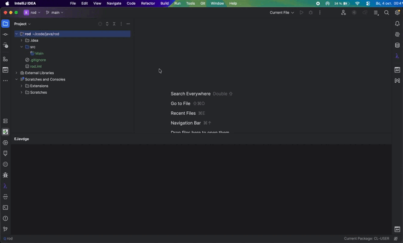
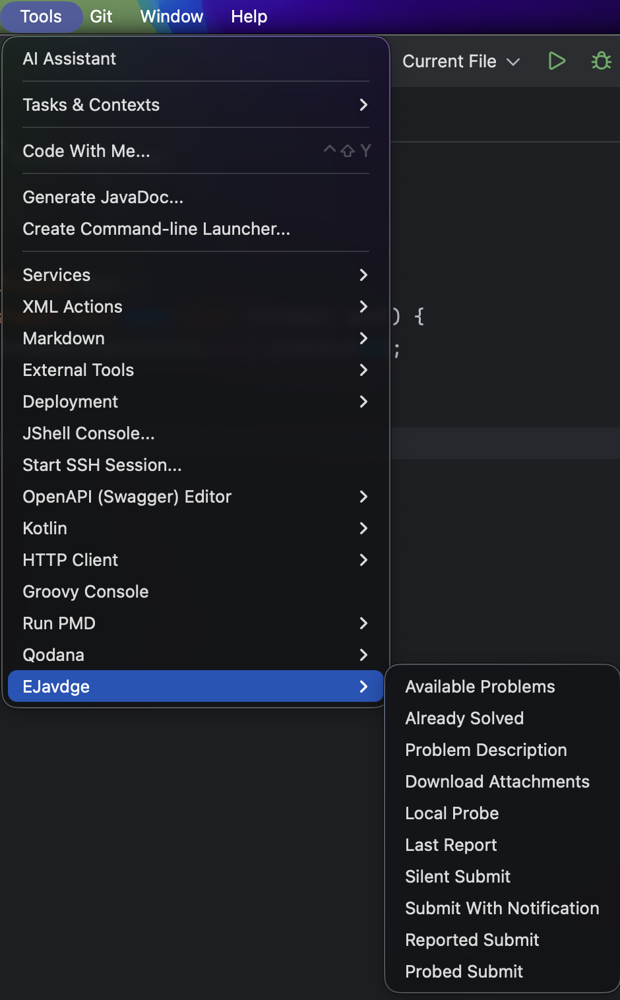
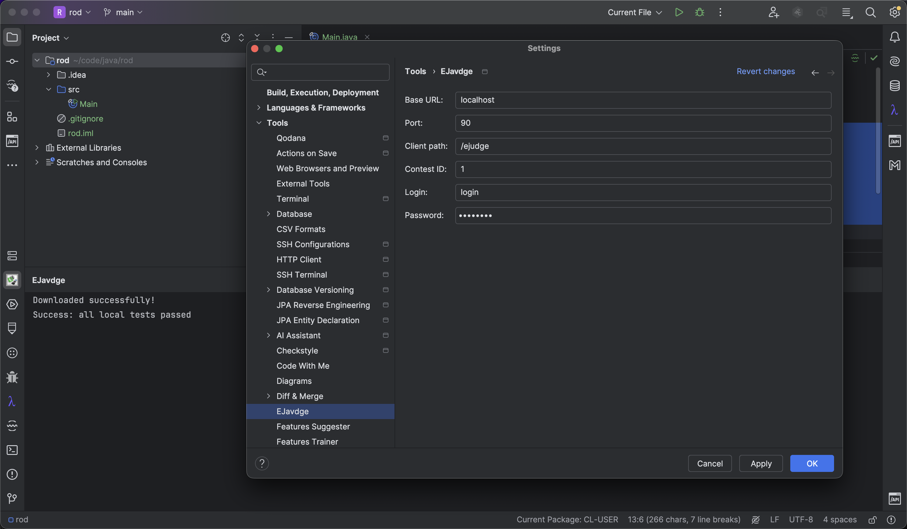
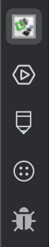
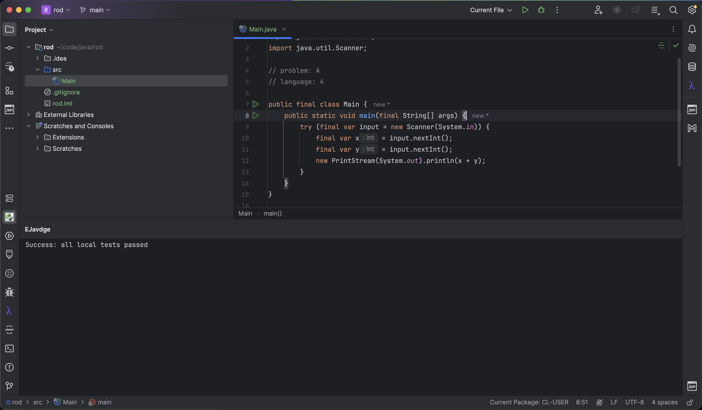
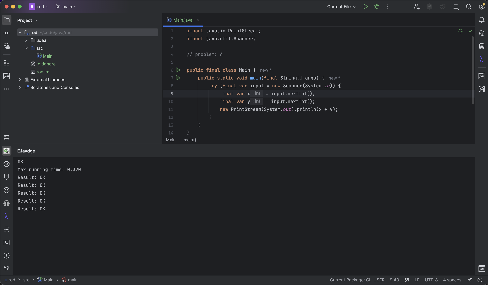

# EJavdge for IntelliJ IDEA

An IntelliJ IDEA plugin for working with ejudge contests. It integrates the
[EJavdge](https://github.com/F1rrock/ejavdge) core library to browse problems,
download attachments, test Java solutions locally, and submit the selected
source file.



## Requirements

### To build
- JDK 17.
- IntelliJ IDEA within the declared platform build range: `232`–`242`
  (2023.2 through 2024.2).
- A Gradle 8.9 wrapper is included, so a Gradle installation is not required.

### To use
- A compatible ejudge contest and account for actions that access the server.
- A JDK available for compiling and running Java solutions.

## Features

Actions are available under **Tools > EJavdge** and in the **EJavdge** toolbar
menu. Output is displayed in the **EJavdge** tool window.



| Action                   | Purpose                                                                                  |
|--------------------------|------------------------------------------------------------------------------------------|
| Available Problems       | List problems in the configured contest.                                                 |
| Already Solved           | List problems already solved by the configured account.                                  |
| Problem Description      | Display the statement for the problem identified in the selected file.                   |
| Download Attachments     | Download the selected problem's attachments to the project directory.                    |
| Local Probe              | Download attachments and run local tests for the selected Java solution.                 |
| Last Report              | Print the latest run's report, falling back to run information when the report is empty. |
| Silent Submit            | Submit the selected file without waiting for the result.                                 |
| Submit With Notification | Submit the selected file and notify when the report is ready.                            |
| Reported Submit          | Submit the selected file and display the resulting report.                               |
| Probed Submit            | Run the selected file against local examples, then submit it and display the report.     |

## Typical Scenarios

### Explore the contest
1. Configure the contest connection (see **Configuration**).
2. Use **Available Problems** to see the list of problems.
3. Use **Already Solved** to see which ones have already been solved.

### Read a problem and its attachments
1. Open the source file that contains the problem marker.
2. Use **Problem Description** to read the statement.
3. Use **Download Attachments** to save the problem's files into the project
   directory, so a solution that reads them works locally.

### Test a solution locally
1. Open the source file with the problem marker.
2. Use **Local Probe** to compile and run the solution against the problem's
   sample tests. The result is printed in the **EJavdge** tool window.

### Submit a solution
Pick the action that matches how much feedback you want:

| Action                       | What it does                                                                                                         |
|------------------------------|----------------------------------------------------------------------------------------------------------------------|
| **Silent Submit**            | Sends the file and returns immediately. Useful when you will check the result in the browser or later.               |
| **Submit With Notification** | Sends the file, waits until the report is ready, and prints a notification.                                          |
| **Reported Submit**          | Sends the file, waits, and prints the report.                                                                        |
| **Probed Submit**            | Runs **Local Probe** first. If local tests fail, the submission is skipped. Otherwise submits and prints the report. |

### Read the latest report
Use **Last Report** to print the report of the latest run without submitting
anything. This is handy when **Silent Submit** was used earlier.

## Create the Plugin Archive

From the plugin repository root, run:

On Windows:
```powershell
.\gradlew.bat buildPlugin
```

On macOS or Linux:
```shell
./gradlew buildPlugin
```

The installable ZIP archive is written to `build/distributions/`.

The plugin depends on `org.msubit:EJavdge:<version>`. The version is configured
by `ejavdgeVersion` in `gradle.properties`. If the build fails to resolve the
core library, install it locally first by running `mvn install` in a checkout
of the [EJavdge core repository](https://github.com/F1rrock/ejavdge).

## Installation

1. Build the plugin archive (see above).
2. Open **Settings > Plugins** in IntelliJ IDEA.
3. Open the gear menu and select **Install Plugin from Disk**.
4. Select the ZIP from `build/distributions/` and restart the IDE.

## Configuration

Open **Settings > Tools > EJavdge** and configure the connection:



| Setting     | Value                                                            |
|-------------|------------------------------------------------------------------|
| Base URL    | The ejudge server hostname or IP address, such as `10.21.17.68`. |
| Port        | The server port, such as `80`.                                   |
| Client path | The ejudge client endpoint, such as `/new-client`.               |
| Contest ID  | The numeric ID of the contest.                                   |
| Login       | Your ejudge username.                                            |
| Password    | Your ejudge password.                                            |

Click **Apply** and **OK** to save. Connection settings are shared across all
projects. The password is stored separately using IntelliJ IDEA's Password Safe.

## Toolbar

To add the EJavdge actions to the main toolbar:

1. Open the gear menu and select **Customize Toolbar**.
2. Choose a position and click **Add**.
3. Choose **Plugins > EJavdge**, select an icon, and click **OK**.
4. Click **Apply** and **OK** to save.



## Usage

1. Open a project with a local directory and configure the contest connection.
2. Use **Available Problems** to find the problem identifier.
3. Add a problem marker to your solution file, replacing `A` with the target
   problem identifier:
```java
// problem: A
```
4. Select the solution file in the editor or in the Project view.
5. Use **Problem Description**, **Download Attachments**, **Local Probe**, or
   one of the submit actions as needed.
6. Open the **EJavdge** tool window to read command output and local test
   results.

After **Download Attachments** and **Local Probe**, the tool window shows the
downloaded files and the local test verdict:



After **Reported Submit** or **Last Report**, the tool window shows the eJudge
report — the verdict, the failing test, and the running time:



## Java Example

The following `Main.java` reads two integers and prints their sum. Replace `A`
with your contest's problem identifier and adapt the solution to the actual
problem statement.

```java
// problem: A
import java.util.Scanner;

public class Main {
    public static void main(String[] args) {
        try (Scanner input = new Scanner(System.in)) {
            long a = input.nextLong();
            long b = input.nextLong();
            System.out.println(a + b);
        }
    }
}
```

Example input:
```text
2 3
```

Expected output:
```text
5
```

Select `Main.java` and use **Local Probe** to run the problem's local tests.
Use one of the submit actions when the solution is ready.

## Troubleshooting

- **The build fails to resolve the EJavdge core library.** Install it locally
  first: run `mvn install` in a checkout of the
  [EJavdge core repository](https://github.com/F1rrock/ejavdge).
- **An action does not appear under Tools.** Check that the plugin is enabled
  in **Settings > Plugins** and restart the IDE.
- **Local Probe reports that `java` is not found.** Make sure a JDK is
  installed and its `bin` directory is on `PATH`.
- **Submission is rejected with an unexpected status.** Verify the
  **Base URL**, **Port**, **Client path**, and **Contest ID** in
  **Settings > Tools > EJavdge**.

## Project Structure

```text
ejavdge-intellij/
├── build.gradle.kts         # Plugin build, dependencies, and IDE compatibility
├── gradle.properties        # Gradle settings and EJavdge core version
├── settings.gradle.kts      # Project name and plugin repositories
├── gradlew                  # Gradle wrapper for macOS and Linux
├── gradlew.bat              # Gradle wrapper for Windows
├── gradle/wrapper/          # Gradle wrapper JAR and configuration
├── .run/                    # Sandbox IDE run configuration
├── README.md
└── src/main/
    ├── java/org/ejavdge/
    │   ├── action/          # Actions for problems, attachments, tests, and submission
    │   ├── error/           # Plugin-specific errors
    │   ├── event/           # Current project and selected file access
    │   ├── log/             # IntelliJ logging integration
    │   ├── out/             # Console output adapters
    │   ├── scalar/          # Scalar interface for IntelliJ operations
    │   ├── settings/        # Connection configuration and credential storage
    │   └── widget/          # EJavdge tool window and console
    └── resources/
        ├── icons/           # Toolbar icon
        └── META-INF/
            ├── plugin.xml       # Plugin metadata, actions, and extensions
            ├── pluginIcon.svg   # Plugin icon displayed in the plugin manager
            └── services/        # Service provider registration
```

## License

MIT. See [LICENSE](LICENSE).